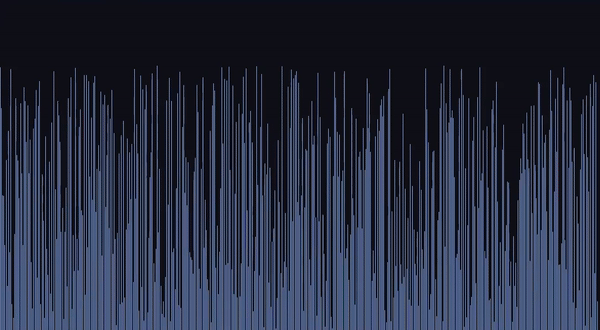
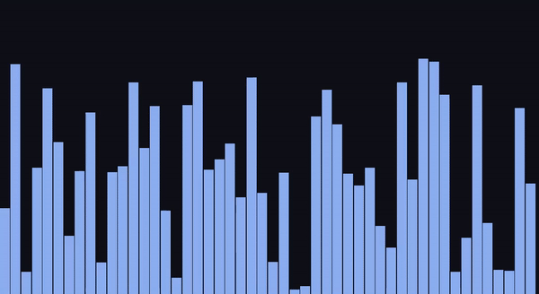

# quicksortVisualized
A visualization of Quick Sort!

Does not show step-by-step, but rather the before, during (albeit quite short), and after.
No frame interpolation or purposeful delay has been added. It is running at its max speed.

works on data sets of any length N > 0

